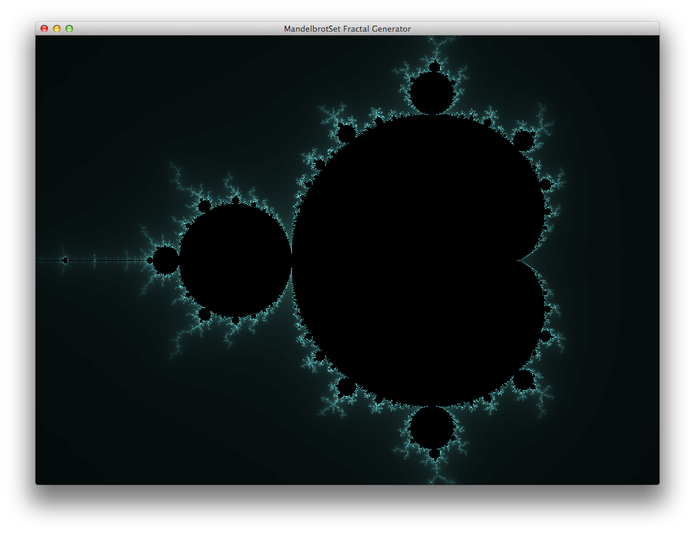

# Mandelbrot Set Generator
This is a simple Java program I've written to play with generating [Mandelbrot set][1] images.

Special thanks to the Youtube Channel [The Coding Train][2] for their [video tutorial][3] on the topic to inspire me and help me understand how to model out the complex numbers logic.

### Run instructions:
Currently the project is not configurable beyond modifying the source code.  To build and run the project from the CLI:

    mkdir out
    javac src/*.java -d out
    java -cp out Main

[1]:https://en.wikipedia.org/wiki/Mandelbrot_set
[2]:https://www.youtube.com/channel/UCvjgXvBlbQiydffZU7m1_aw
[3]:https://www.youtube.com/watch?v=6z7GQewK-Ks
